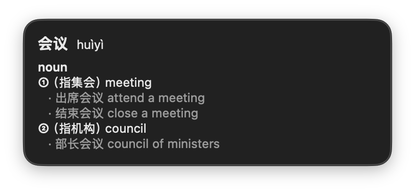
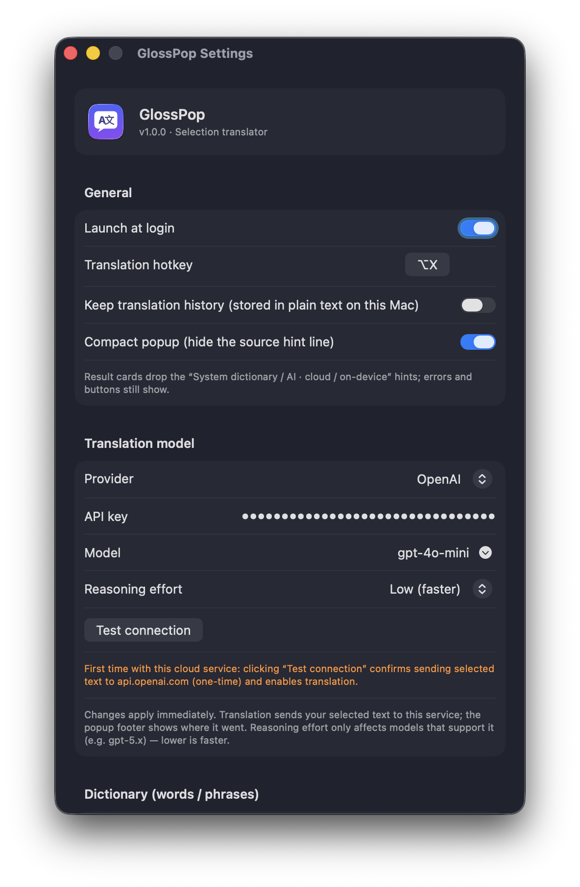

# GlossPop

**English** | [简体中文](README.zh-Hans.md)

**Swipe-to-translate for macOS.** Select text anywhere, press one hotkey, and get an **LLM translation that's also a dictionary and a grammar tutor** — streamed into a near-cursor panel that **never touches your clipboard** and **never steals focus**.

   [](https://github.com/Goldenmonstew/GlossPop/releases/latest) 

<p align="center">
  <a href="https://github.com/Goldenmonstew/GlossPop/releases/latest"><b>⬇️&nbsp;&nbsp;Download GlossPop</b></a> — free, notarised by Apple, auto-updates
</p>

<p align="center">
  
</p>

The UI follows your system language — English, 简体中文, 繁體中文, 日本語, 한국어, Français, Deutsch, Español, Русский.

## What makes it different

Most swipe-translators are fragile (resident event taps that lag the system, clipboard pollution) and just dump a flat translation. GlossPop is **input-aware** and reliable:

- 🧠 **It adapts to what you select.** A word or phrase → a full **dictionary** entry (pronunciation, part-of-speech senses, examples, synonyms, idioms). A sentence → **translation + syntax analysis** (clauses, subject/predicate/object, grammar points, word-by-word gloss). Plain phrases → a clean streamed translation.
- 🔑 **Your model.** Translation runs on the LLM you choose — **bring your own key** to any OpenAI-compatible endpoint (cloud, a relay, or a local **Ollama** / **LM Studio**), or on-device **Apple Foundation Models** where available.
- 🔒 **Zero side-effects.** Accessibility-first capture — no resident `CGEventTap`, the clipboard is never touched by default, focus never leaves your app. A provenance badge tells you exactly where your text went.

## Install

1. Download the latest **`GlossPop-x.y.z.dmg`** from the [**Releases**](https://github.com/Goldenmonstew/GlossPop/releases/latest) page (notarized by Apple).
2. Open the DMG and drag **GlossPop** to **Applications**.
3. Launch it — a 💬 icon appears in the menu bar. On first run, grant **Accessibility** when prompted (System Settings ▸ Privacy & Security ▸ Accessibility ▸ enable GlossPop). This is how it reads your selection without the clipboard.

Updates are delivered automatically via [Sparkle](https://sparkle-project.org) (or menu ▸ Check for Updates…).

## Use

- Select text in any app → press **⌃⌘T** → the panel pops up near your cursor.
- **Esc** or click away to dismiss. The selection in the source app stays intact.
- Open **Settings…** from the menu-bar icon to choose the target language, output mode, and translation engine.

## Bring your own model (BYOK)

<p align="center">
  
</p>

Settings ▸ *Translation model*:

1. **Provider / Endpoint** — any OpenAI-compatible endpoint (OpenAI, DeepSeek, your relay, or `http://localhost:11434` for Ollama).
2. **API key** — stored in your macOS **Keychain**, never anywhere else.
3. **Model** — type it, or fetch the list from `/v1/models`; **Test connection** verifies it end-to-end.
4. Changes apply immediately — the first test on a new cloud host doubles as your one-time consent.

When the endpoint is a cloud/relay host, the panel's footer is badged **“cloud”** so you always know your text left the machine; loopback (`localhost`) is badged **“on-device”**. The UI is localised into English, 简体中文, 繁體中文, 日本語, 한국어, Français, Deutsch, Español and Русский, following your system language.

## Privacy

- **Zero clipboard by default**, and the word/phrase path can run fully offline (macOS system dictionary). Nothing is ever sent to a cloud host until you configure one and confirm it once via **Test connection**.
- The optional Tier-2 “synthetic copy” fallback (for apps that don't expose selection, e.g. Safari/Electron) is **off by default**; when on, it restores your clipboard immediately.
- Your selection isn't stored or logged unless you turn on **Translation History** (off by default; kept locally in plain text, clearable anytime).

## Build from source

Requires Xcode 26+ and [XcodeGen](https://github.com/yonaskolb/XcodeGen) (`brew install xcodegen`).

```bash
make build   # xcodegen generate + xcodebuild
make run     # build + launch
make test    # unit tests
```

Maintainer release pipeline (Developer ID sign → notarize → DMG → Sparkle appcast) lives in [`scripts/release.sh`](scripts/release.sh).

## Contributing

Issues and PRs welcome — see [CONTRIBUTING.md](CONTRIBUTING.md). macOS 15+, Universal (Apple Silicon + Intel), Swift 6 (strict concurrency).

## License

[AGPL-3.0-or-later](LICENSE). © 2026 wanruncong.
